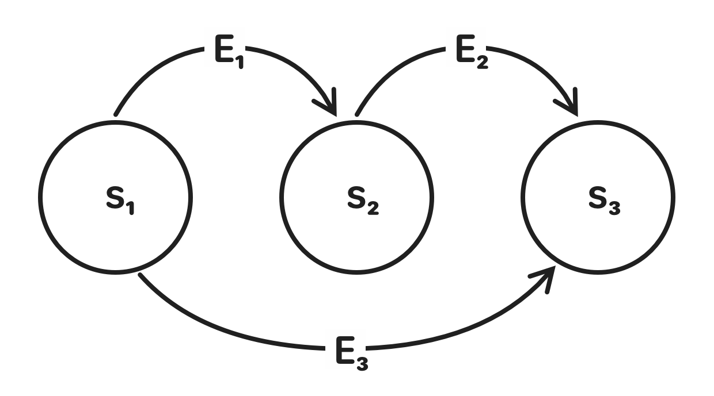

# MiamiStateMachine

> *Come on, shake your body, baby, do the conga<br/>
> I know you can't control yourself any longer*
> 
—Enrique Garcia

MiamiStateMachine is a small finite state machine implementation written in Swift.
It uses a Swift actor to protect the current state and the definition of the state machine
from unsafe modification.

## Motivation

I needed a state machine I could trust to consider things like concurrent use. 
The only available alternative in the macOS, iOS or iPadOS platform frameworks, 
is `GKStateMachine` in GameplayKit. This is an Objective-C based state machine,
seemingly not updated since its introduction. It is unclear to me if `GKStateMachine`
does anything to try to be thread-safe or if this is up to the developer using
the framework.

## Concepts

A `StateMachine` has a `state: State` (the current state). The `State` is a type
conforming to `Hashable` and `Sendable`. An `enum` defining the possible states works well. 

The transitions between states are defined by `Transition`, a value with the `from: State`, the
`event: Event` needed to do the transition and the `to: State` where the state machine ends up.

The `Event` is also a type conforming to `Hashable & Sendable`, usually an enum.

To make the state machine process an event, the `process(:)` is used. If a transition is 
defined for the event from the current state, the state machine's current state will change.

## Usage

Start by defining the possible states and events. Enumerations works well for this:

```
enum MyState {
    case s1, s2, s3
}

enum MyEvent {
    case e1, e2, e3
}
```

The state machine is defined by the transitions it can do:

```
typealias MyTransition = Transition<MyEvent, MyState>

let transitions: Set<MyTransition> = [
    Transition(from: .s1, event: .e1, to: .s2),
    Transition(from: .s2, event: .e2, to: .s3),
    Transition(from: .s1, event: .e3, to: .s3),
]
```

The state machine can now be created with the transitions:

```
let stateMachine = StateMachine(transitions: transitions, initialState: .s1)
```



The state machine is now an `StateMachine<MyEvent, MyState>?`—optional due to 
the failable initializer. Creation of the state machine will fail if the transitions
define an inconsistent state machine. A consistent state machine is one where an event
at a state always leads to the same transition.

Now the state machine can process events. Processing events needs to be done in
an asynchronous context:

```
Task {
  // Initial state is s1
    
  await stateMachine?.process(.e1)

  // State is s2
    
  await stateMachine?.process(.e2)

  // State is s3

  await stateMachine?.process(.e3)
    
  // State is still s3. Event e3 had no effect.

  await stateMachine?.atEndingState
    
  // True as s3 state has no transitions defined for any event.
}
```

## Reacting to state changes

By listening to the `doneTransitionStream: AsyncStream<Transition<Event, State>>` stream, it is possible to react to state changes.

There is also `rejectedEventStream: AsyncStream<(from: State, for: Event)>` to be able to know when processed events did __not__ lead to a state change.

The `AsyncStream` based solution is a sort of workaround while waiting for Swift to improve observation of values in an actor.

## What's with the name?

Look, naming is hard, ok? If nothing else, we all know *the rhythm is gonna get you*. 
Just be happy I didn't name it `RageAgainstTheStateMachine`.

## Improvements

Suggestions, issues and or PRs are more than welcome, but remember: *kindness before code*. 

## Author
Copyright &copy; 2022 Erik Tjernlund <erik@tjernlund.net>
