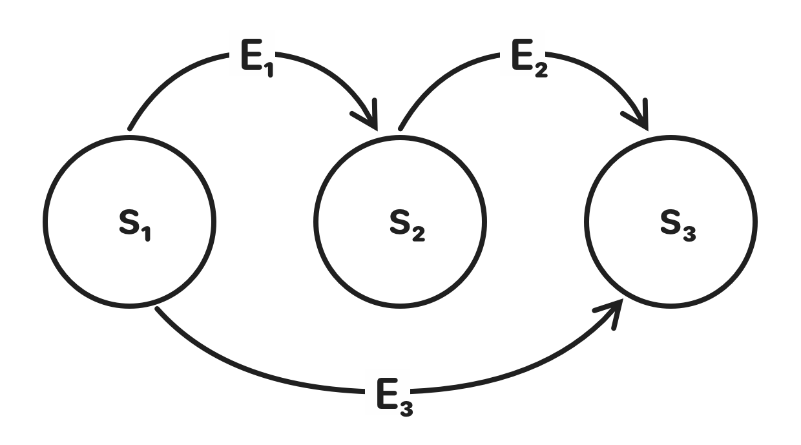

# MiamiStateMachine

> *Come on, shake your body, baby, do the conga<br/>
> I know you can't control yourself any longer*
> 
—Enrique Garcia

MiamiStateMachine is a small finite state machine implementation written in Swift.
It uses a Swift actor to protect the current state and the definition of the state machine
from unsafe modification.

## Motivation

I needed a state machine I could trust to consider things like concurrent use. 
The only available alternative in the macOS, iOS or iPadOS platform frameworks, 
is `GKStateMachine` in GameplayKit. This is an Objective-C based state machine,
seemingly not updated since its introduction. It is unclear to me if `GKStateMachine`
does anything to try to be thread-safe or if this is up to the developer using
the framework.

## Concepts

A `StateMachine` has a `state: State` (the current state). The `State` is a type
conforming to `Hashable` and `Sendable`. An `enum` defining the possible states works well. 

The transitions between states are defined by `TransitionRule`, a value with the `from: State`, the
`event: Event` needed to do the transition and the `to: State` where the state machine ends up.

The `Event` is a type conforming to `StateMachineEvent`, usually an enum.

To make the state machine process an event, the `process(_:)` is used. If a transition is 
defined for the event from the current state, the state machine's current state will change.

## Installation

MiamiStateMachine is a Swift package, and needs Swift 6.3 (Xcode 26.4) or later. It supports macOS 15, iOS 18, tvOS 18, watchOS 11 and visionOS 2.

Add the package to the dependencies in `Package.swift`:

```
.package(url: "https://github.com/erikt/MiamiStateMachine.git", from: "4.0.0")
```

Then add the libraries to use to the dependencies of a target. `MiamiStateMachine` is the state machine itself.
`MiamiUI`, `MiamiDiagrams` and `MiamiMacros` are only needed for what is described further down:

```
.product(name: "MiamiStateMachine", package: "MiamiStateMachine"),
.product(name: "MiamiUI", package: "MiamiStateMachine"),
.product(name: "MiamiDiagrams", package: "MiamiStateMachine"),
.product(name: "MiamiMacros", package: "MiamiStateMachine"),
```

In Xcode, add it as a package dependency of the project, with the same URL.

## Documentation

The documentation of the four libraries is at [erikt.github.io/MiamiStateMachine](https://erikt.github.io/MiamiStateMachine/).

## Usage

Start by defining the possible states and events. Enumerations works well for this:

```
enum MyState {
    case s1, s2, s3
}

enum MyEvent: StateMachineEvent {
    case e1, e2, e3
}
```

The state machine is defined by the transitions it can do:

```
typealias MyTransition = TransitionRule<MyEvent, MyState>

let transitions: Set<MyTransition> = [
    TransitionRule(from: .s1, event: .e1, to: .s2),
    TransitionRule(from: .s2, event: .e2, to: .s3),
    TransitionRule(from: .s1, event: .e3, to: .s3),
]
```

The state machine can now be created with the transitions:

```
let stateMachine = try StateMachine(transitions: transitions, initialState: .s1)
```



Alternatively, there is also a declarative result builder DSL:

```
let stateMachine = try StateMachine<MyEvent, MyState>(initialState: .s1) {
    From(.s1) {
        On(.e1, to: .s2)
        On(.e3, to: .s3)
    }
    From(.s2) {
        On(.e2, to: .s3)
    }
}
```

`From(allExcept:)` and `AtEveryState(_:)` make rules for many states, as described below, and `if` 
and `for` can be used as in any other code. An `ObservableStateMachine` can be created the same way.

Creating the state machine throws an error if the transitions define an inconsistent state
machine. A consistent state machine is one where an event at a state always leads to the same
transition. The error is a `DefinitionError`, and its `conflictingTransitions` tells which
transitions lead from the same state, for the same event, to different states:

```
do {
    let stateMachine = try StateMachine(transitions: transitions, initialState: .s1)
} catch {
    print(error.conflictingTransitions)
}
```

Now the state machine can process events. Processing events needs to be done in
an asynchronous context:

```
Task {
  // Initial state is s1
    
  await stateMachine.process(.e1)

  // State is s2
    
  await stateMachine.process(.e2)

  // State is s3

  await stateMachine.process(.e3)
    
  // State is still s3. Event e3 had no effect.

  await stateMachine.isAtEndingState
    
  // True as s3 state has no transitions defined for any event.
}
```

Processing an event returns the transition made, or `nil` if the event was rejected. This tells what the
event led to, also when other tasks are processing events at the same time:

```
if let transition = await stateMachine.process(.e1) {
    print("Entered \(transition.to)")
} else {
    print("The event was rejected")
}
```

When a rejected event is an error, use `processOrThrow(_:)` instead. It throws the event as a `RejectedEvent`, with the
`state` it was rejected at:

```
do {
    let transition = try await stateMachine.processOrThrow(.e1)
    print("Entered \(transition.to)")
} catch {
    print("\(error.event) was rejected at \(error.state)")
}
```

## Events with values

An event can carry something, like the data loaded or the reason for a failure. The transitions are then written
with the event trigger, which is the event without what it carries. The `MiamiMacros` library has a macro writing the
triggers, the mapping and the conformance:

```
import MiamiStateMachine
import MiamiMacros

enum LoadState {
    case idle, loading, ready, failed
}

@StateMachineEvent
enum LoadEvent {
    case start
    case finish(bytes: Int)
    case fail(reason: String)
}

let transitions: Set<TransitionRule<LoadEvent.EventTrigger, LoadState>> = [
    TransitionRule(from: .idle, event: .start, to: .loading),
    TransitionRule(from: .loading, event: .finish, to: .ready),
    TransitionRule(from: .loading, event: .fail, to: .failed),
]

let stateMachine = try StateMachine<LoadEvent, LoadState>(transitions: transitions, initialState: .idle)
```

The macro is a plugin of the compiler, and Xcode asks for it to be trusted the first time it is used.

The state machine never looks at what an event carries. It is delivered with the event, by `process(_:)`, the streams
and the log:

```
await stateMachine.process(.start)

if let made = await stateMachine.process(.finish(bytes: 512)) {
    print("Entered \(made.to)")

    switch made.event {
    case .finish(let bytes):
        print("Loaded \(bytes) bytes")
    case .fail(let reason):
        print("Failed: \(reason)")
    case .start:
        break
    }
}

// Entered ready
// Loaded 512 bytes
```

An event carrying something has to have an `EventTrigger` of its own. Without the macro, the triggers, the mapping and
the conformance are written by hand:

```
enum LoadEvent: StateMachineEvent {
    case start
    case finish(bytes: Int)
    case fail(reason: String)

    enum EventTrigger {
        case start, finish, fail
    }

    var eventTrigger: EventTrigger {
        // Map event to trigger
        switch self {
        case LoadEvent.start:
            return EventTrigger.start
        case LoadEvent.finish:
            return EventTrigger.finish
        case LoadEvent.fail:
            return EventTrigger.fail
        }
    }
}
```

An event without an `EventTrigger` is its own trigger, and what it carries then decides the transition.

Keep in mind, the log keeps the events, including the carried values. If the values are large, keep memory consumption
down by setting a capacity on the state machine log:

```
StateMachine<LoadEvent, LoadState>(transitions: transitions, initialState: .idle, logCapacity: 10)
```

## The same event from many states

When the same event leads from many states to one state, like a machine that can break down whatever it is doing, the
rules can be made from the cases of a `CaseIterable` state:

```
enum VendingState: CaseIterable {
    case idle, hasCredit, outOfOrder
}

enum VendingEvent: StateMachineEvent {
    case insertCoin, repair, breakDown, refill
}

let rules: Set<TransitionRule<VendingEvent, VendingState>> = [
    TransitionRule(from: .idle, event: .insertCoin, to: .hasCredit),
    TransitionRule(from: .outOfOrder, event: .repair, to: .idle),
]
let transitions = rules
    .union(TransitionRule.from(allExcept: [.outOfOrder], event: .breakDown, to: .outOfOrder))
    .union(TransitionRule.atEveryState(event: .refill))
```

`from(allExcept:event:to:)` makes a rule from every state but the excluded ones, and `atEveryState(event:)` a rule at
every state, leading back to the same state. They are ordinary rules, checked like any other when the state machine is
created. Leave the state led to out, unless it should lead back to itself: a state with a rule back to itself is not an
ending state.

Written state by state, the same rules are `From(allExcept: [.outOfOrder]) { On(.breakDown, to: .outOfOrder) }` and
`AtEveryState(.refill)`.

## Reacting to state changes

To react to the transitions made by the state machine, ask it for a stream of transitions:

```
let transitions = await stateMachine.transitionStream()

Task {
    for await transition in transitions {
        print("Entered \(transition.to) by \(transition.event)")
    }

    // The state machine has reached an ending state, or is deallocated.
}
```

There is also `rejectedEventStream()`, to be able to know when processed events did __not__ lead to a transition. Its
elements are `RejectedEvent` values, with the rejected `event` and the `state` the state machine was at.

If what matters is where the state machine is, and not how it got there, ask for a stream of states. It starts with the
current state, so it can be created at any time without missing where the state machine is:

```
let states = await stateMachine.stateStream()

Task {
    for await state in states {
        print("The state machine is at \(state)")
    }
}
```

Some things to know about the streams:

- Every call creates a new stream. Several consumers can listen at the same time, and all of them get every element.
- A stream delivers what happens after it was created. Create the stream before processing the events of interest, as
  above. A stream created inside a new task may miss events, as the task can start running after they were processed.
  A stream of states is the exception, as it always starts with the current state.
- A stream of transitions, or of states, finishes when the state machine reaches an ending state. A stream of rejected
  events does not, as events are rejected at an ending state too. All of them finish when the state machine is deallocated.
- Cancelling the task of a consumer, or letting go of a stream, ends only that stream. Ask for a new stream to start
  listening again.
- A stream keeps its elements until they are consumed, without any limit. If only the latest are of interest, pass a
  buffering policy: `stateStream(bufferingPolicy: .bufferingNewest(1))`.
- A transition leading back to the same state is delivered like any other, and delivers the state again on a stream of
  states.
- Use the transition received to know the state entered, and not `state`. The state machine may have moved on.

To wait for one particular state, without a stream of your own, use `wait(for:)`. It returns true when the state machine
gets to the state, at once if it is already there. It returns false if the state can no longer be reached, like at
another ending state, or if the task is cancelled:

```
if await stateMachine.wait(for: .s3) {
    print("The state machine is at s3")
}
```

Like a stream, it only knows what happens after it is called, so a state entered and left again before that is missed.

The `AsyncStream` based solution is a sort of workaround while waiting for Swift to improve observation of values in an actor.

## Timing out a state

To process an event after some time, if the state machine is still at a state by then, like giving up a connection,
use `process(_:after:ifStillAt:)`:

```
Task {
    try await connection.process(.timeout, after: .seconds(10), ifStillAt: .connecting)
}
```

It waits for the time and processes the event, if the state machine has stayed at the state all the time. A transition
in between, also one back to the same state, ends the waiting at once, and the event is not processed: it then returns
nil, as for a rejected event. Cancelling the task cancels the timeout. A `clock:` can be given, for tests.

## A state machine in SwiftUI

The package has a second library, `MiamiUI`, for user interfaces. Its `ObservableStateMachine` has the current state as
an observable property on the main actor, so a SwiftUI view using the state is updated when the state machine makes a
transition:

```
import SwiftUI
import MiamiStateMachine
import MiamiUI

struct MyView: View {
    let stateMachine: ObservableStateMachine<MyEvent, MyState>

    var body: some View {
        Text("The state is \(String(describing: stateMachine.state))")

        Button("Process e1") {
            stateMachine.send(.e1)
        }
        .disabled(stateMachine.accepts(.e1) == false)
    }
}
```

It is created from a state machine, and is best kept in the `@State` of the view owning it:

```
let observableStateMachine = ObservableStateMachine(stateMachine)
```

The state machine is still the one deciding. `send(_:)` sends an event to it without waiting, and events are processed
in the order they are sent. `process(_:)` does the same, but waits for the event and returns the transition made, or
nil if the event was rejected. `state` follows what the state machine does, a moment later. The same state machine can
be used by other parts of an app at the same time, and `state` follows their events too. There are also `accepts(_:)`,
`eventsFromCurrent` and `isAtEndingState`, for enabling buttons and the like. For anything else, the state machine is
there as `stateMachine`.

It follows the state machine with `stateStream()`, and stops when it is no longer in use.

## The transition log

The state machine keeps a log of the transitions made. The log is a collection, from the oldest transition to the newest:

```
let log = await stateMachine.transitionLog

for transition in log {
    print(transition)
}

let latest = log.last
```

The log keeps every transition by default. To only keep the latest, give the log a capacity when creating the state
machine: `StateMachine(transitions: transitions, initialState: .s1, logCapacity: 10)`.

## Finding the shortest path between states

The state machine can tell how to get from one state to another with the fewest events:

```
let path = stateMachine.shortestPath(from: .s1, to: .s3)

// [s1 --(e3)--> s3]
```

The path is the list of transitions to make, in order. For the state machine above, the shortest path from `s1` to `s3`
is the single transition for the event `e3`, and not the two transitions for `e1` and `e2`. Processing the event of each
transition, in order, takes a state machine that is in the first state of the path to the last one:

```
for transition in path ?? [] {
    await stateMachine.process(transition.event)
}
```

For events carrying something, the transitions of the path have the event triggers to process, and not the events.

If there is no way to get to the state, the path is `nil`. The path from a state to the same state is empty. If there is
more than one shortest path, one of them is returned.

The shortest path between two states is part of the definition of the state machine and does not depend on the current
state, so there is no need for an asynchronous context. To get the shortest path from the current state, use
`shortestPath(to:)`, which must be awaited:

```
let pathFromCurrent = await stateMachine.shortestPath(to: .s3)
```

## Checking the definition

The state machine can answer questions about its definition as a whole. They are made for finding mistakes in a
definition, and fit well in a unit test:

```
// States the state machine will never be at, as nothing leads to them from the initial state.
stateMachine.unreachableStates

// States from where the state machine can never get to an ending state.
stateMachine.statesWithoutPathToEndingState

// If there is a way from a state back to the same state, so that the state machine can go on forever.
stateMachine.hasCycle
```

For the state machine above, the first two are empty and the last is `false`. An unreachable state is often a forgotten
transition, or a transition leading to the wrong state. A state machine without ending states, meant to go on forever,
has all its states without a path to an ending state.

There are also `states`, `endingStates` and `reachableStates(from:)`. A state is always reachable from itself:

```
stateMachine.reachableStates(from: .s2)

// [s2, s3]
```

All of these are part of the definition of the state machine, so there is no need for an asynchronous context. For the
states that can still be reached from the current state, use `reachableStatesFromCurrent`, which must be awaited.

## Drawing the state machine

The `.dotDiagram` property on the state machine creates a [GraphViz DOT format](https://graphviz.org) string, and the `.mermaidDiagram` property creates a [Mermaid](https://mermaid.js.org) string. They can be used to render the state machine as a diagram. The `.dotDiagramWithCurrentState` and `.mermaidDiagramWithCurrentState` properties create the same strings with the current state marked, and must be awaited. The properties are in the `MiamiDiagrams` library of the package, which has to be imported.

## Following the state machine in Instruments

A state machine can be followed in Instruments with the os_signpost instrument. Every state is an interval, ended by
the event leaving it, every rejected event is a signpost event, and every state machine has a lane of its own. Add
`MiamiStateMachine` to the subsystems for dynamic tracing in the recording options of the instrument. The signposts are
only written while Instruments records them, and cost next to nothing otherwise.

## What's with the name?

Look, naming is hard, ok? Just be happy I didn't name it `RageAgainstTheStateMachine`.

## Improvements

Suggestions, issues and or PRs are more than welcome, but remember: *kindness before code*. 

## Author
Copyright &copy; 2022 Erik Tjernlund <erik@tjernlund.net>
